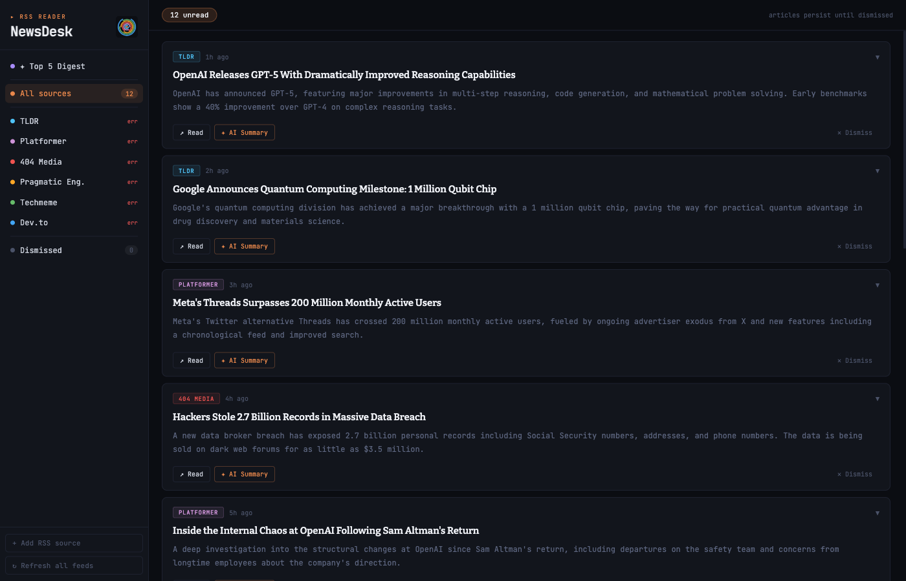
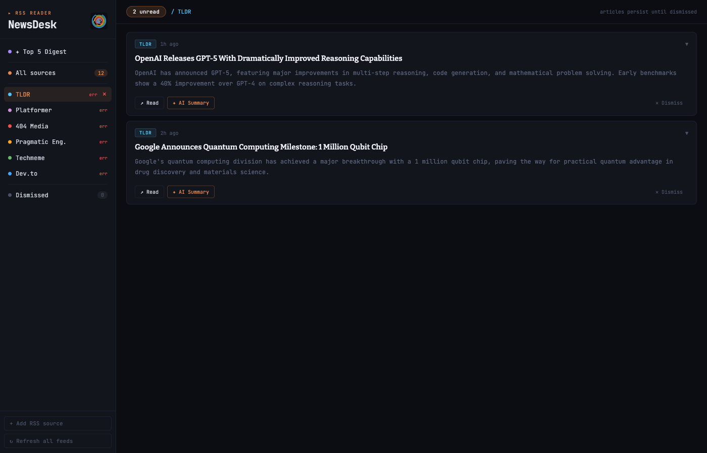
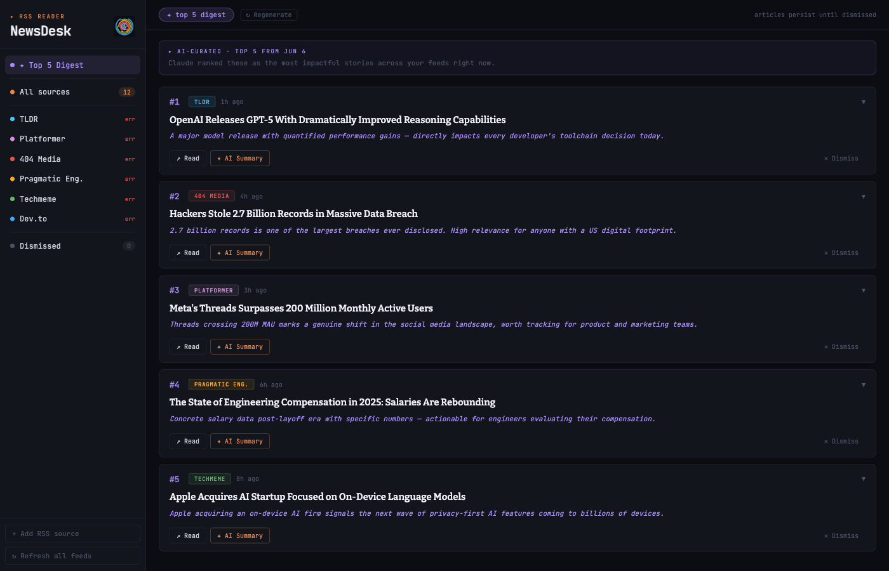
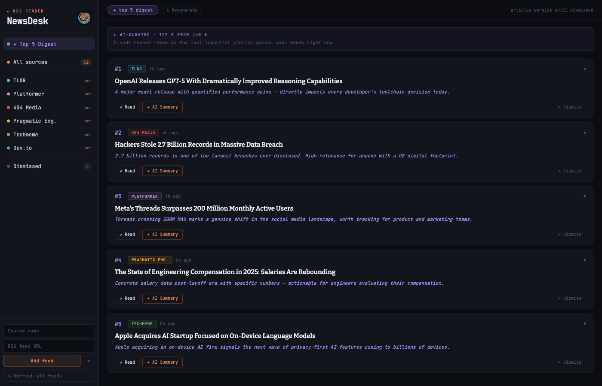

# NewsDesk

A dark-themed RSS reader with AI-powered article summaries and a daily digest. Deployed on Vercel with serverless API routes backed by Claude.



## Features

- **Multi-source RSS feed** — aggregates articles from all your feeds in reverse-chronological order, persisted in localStorage until you dismiss them
- **Per-source filtering** — click any source in the sidebar to see only its articles
- **AI Summary** — on-demand single-article summaries via Claude (Sonnet 4.6), written for a technical audience
- **Top 5 Digest** — Claude reads up to 60 unread articles and picks the 5 most impactful, with a one-sentence rationale for each
- **Dismiss** — removes articles from your queue; a Dismissed view lets you review and restore them
- **Add/remove sources** — paste any RSS feed URL to add it; hover a source to reveal the remove button
- **Auto-refresh** — feeds refresh on load and can be manually refreshed from the sidebar

## Screenshots

### All sources feed


### Single source filtered view


### Top 5 Digest


### Adding an RSS source


## Tech stack

| Layer | Technology |
|---|---|
| Frontend | React 18, Vite |
| Styling | Inline styles, JetBrains Mono, Bitter |
| RSS proxy | Vercel serverless function (`/api/feed`) |
| AI summaries | Vercel serverless function (`/api/summarize`) → Claude Sonnet 4.6 |
| AI digest | Vercel serverless function (`/api/digest`) → Claude Sonnet 4.6 |
| Persistence | `localStorage` (articles, dismissed set, custom sources) |
| Hosting | Vercel |

## Default sources

TLDR, Platformer, 404 Media, Pragmatic Engineer, Techmeme, Dev.to — all removable, any RSS URL addable.

## Setup

### Prerequisites

- Node.js 18+
- [Vercel CLI](https://vercel.com/docs/cli): `npm i -g vercel`
- An [Anthropic API key](https://console.anthropic.com/)

### Local development

```bash
npm install
```

Add your API key to Vercel (or create a `.env.local`):

```bash
# .env.local
ANTHROPIC_API_KEY=sk-ant-...
```

Run with Vercel dev (needed for the serverless API routes):

```bash
vercel dev
```

The app opens at `http://localhost:3000` (or whichever port Vercel assigns).

### Deploy

```bash
vercel --prod
```

Set `ANTHROPIC_API_KEY` in your Vercel project's environment variables before deploying.

## Project structure

```
newsdesk/
├── api/
│   ├── feed.js        # RSS proxy (fetches & parses feeds server-side)
│   ├── summarize.js   # Single-article AI summary
│   └── digest.js      # Top-5 AI digest picker
├── src/
│   ├── main.jsx       # React entry point
│   ├── NewsDesk.jsx   # Single-file app component
│   └── utils.js       # strip() and ago() helpers
├── public/
│   └── favicon.svg
├── index.html
└── vercel.json
```

## Tests

```bash
npm test
```

105 tests covering RSS parsing, feed proxy, summarize/digest API handlers, and utility functions.
